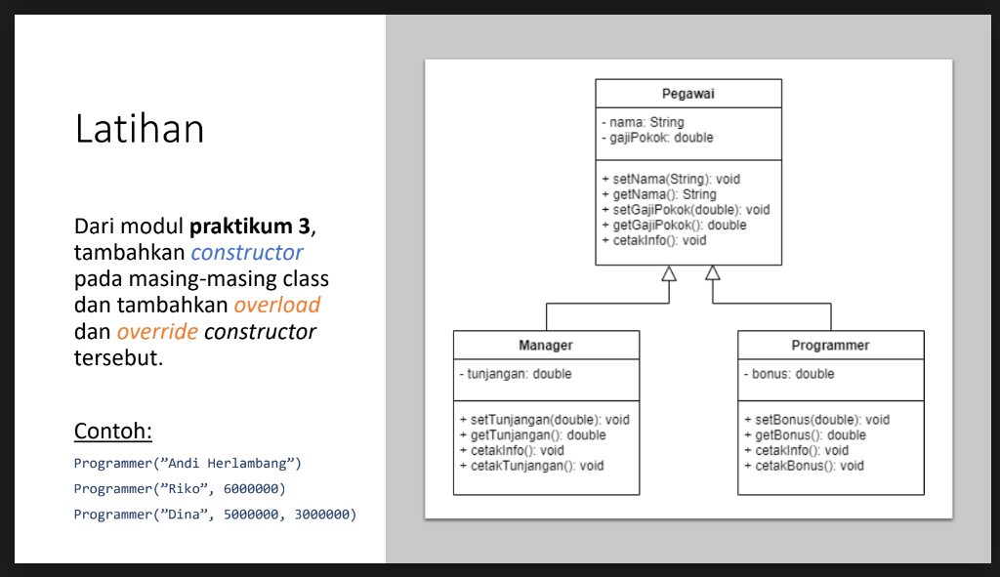

# Constructor
```
NIM     : 312310576
NAMA    : TAUFIK HIDAYAT
KELAS   : TI.23.A6
MATKUL  : Pemrograman Orientasi Objek
```
## Latihan

## Penjelasan

- Sistem Pegawai mensimulasikan struktur dasar dalam manajemen sumber daya manusia. Kita memiliki kelas dasar Pegawai dengan dua kelas turunan, yaitu Manager dan Programmer, masing-masing memiliki atribut dan perilaku spesifik.

Kelas Pegawai (Kelas Dasar)
```
class Pegawai {
    protected String nama;
    protected double gajiPokok;

    // Constructor with no parameters
    public Pegawai() {
        this.nama = "";
        this.gajiPokok = 0.0;
    }

    // Constructor with name parameter
    public Pegawai(String nama) {
        this.nama = nama;
        this.gajiPokok = 0.0;
    }

    // Constructor with name and gajiPokok
    public Pegawai(String nama, double gajiPokok) {
        this.nama = nama;
        this.gajiPokok = gajiPokok;
    }

    public void setNama(String nama) {
        this.nama = nama;
    }

    public String getNama() {
        return nama;
    }

    public void setGajiPokok(double gajiPokok) {
        this.gajiPokok = gajiPokok;
    }

    public double getGajiPokok() {
        return gajiPokok;
    }

    public void cetakInfo() {
        System.out.println("Nama: " + nama);
        System.out.println("Gaji Pokok: " + gajiPokok);
    }
}
```
Atribut:
nama (String): Menyimpan nama pegawai.
gajiPokok (double): Menyimpan gaji pokok pegawai.
Metode:
setNama(String): Mengatur nama pegawai.
getNama(): Mengembalikan nama pegawai.
setGajiPokok(double): Mengatur gaji pokok pegawai.
getGajiPokok(): Mengembalikan gaji pokok pegawai.
cetakInfo(): Mencetak informasi dasar pegawai (nama dan gaji pokok).
