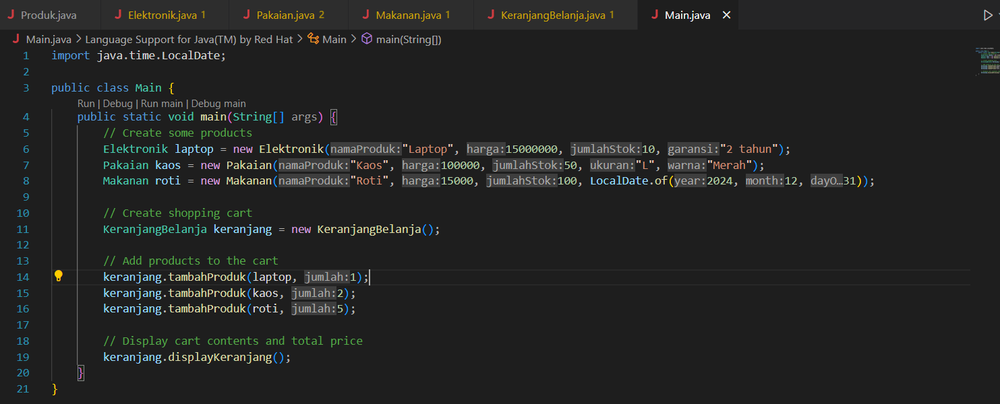

# Constructor
```
NIM     : 312310576
NAMA    : TAUFIK HIDAYAT
KELAS   : TI.23.A6
MATKUL  : Pemrograman Orientasi Objek
```
## Latihan Praktikum 3

## Penjelasan

#### Sistem Pegawai
- Mensimulasikan struktur dasar dalam manajemen sumber daya manusia. Kita memiliki kelas dasar Pegawai dengan dua kelas turunan, yaitu Manager dan Programmer, masing-masing memiliki atribut dan perilaku spesifik.

#### Kelas Pegawai (Kelas Dasar)


#### Atribut:
- nama (String): Menyimpan nama pegawai.
- gajiPokok (double): Menyimpan gaji pokok pegawai.
#### Metode:
- setNama(String): Mengatur nama pegawai.
- getNama(): Mengembalikan nama pegawai.
- setGajiPokok(double): Mengatur gaji pokok pegawai.
- getGajiPokok(): Mengembalikan gaji pokok pegawai.
- cetakInfo(): Mencetak informasi dasar pegawai (nama dan gaji pokok).
#### Kelas Manager (Turunan dari Pegawai)

#### Atribut:
- tunjangan (double): Menyimpan tunjangan khusus untuk seorang manager.
#### Metode:
- setTunjangan(double): Mengatur tunjangan manager.
- getTunjangan(): Mengembalikan tunjangan manager.
- cetakInfo(): Meng-override metode cetakInfo() untuk menambahkan informasi tentang tunjangan manager.

#### Kelas Programmer (Turunan dari Pegawai)

#### Atribut:
- bonus (double): Menyimpan bonus khusus untuk seorang programmer.
#### Metode:
- setBonus(double): Mengatur bonus programmer.
- getBonus(): Mengembalikan bonus programmer.
- cetakInfo(): Meng-override metode cetakInfo() untuk menambahkan informasi tentang bonus programmer.
#### Constructor dan Overloading dalam Programmer
#### Constructor
- Kelas Programmer memiliki constructor overload yang memungkinkan pembuatan objek dengan parameter yang berbeda (hanya nama, nama dengan gaji pokok, atau nama dengan gaji pokok dan bonus).
#### Polimorfisme:

- Manager dan Programmer keduanya meng-override cetakInfo() untuk menampilkan informasi spesifik (tunjangan untuk Manager dan bonus untuk Programmer), yang menunjukkan konsep polimorfisme.
#### Main.Java(Kelas Utama)

- Kelas Main adalah titik masuk program di mana kita melakukan pengujian pada program sistem pegawai tersebut:
#### Output

## Studi Kasus : Sistem Pembelian Online Dengan Keranjang Belanja

- Sistem Keranjang Belanja ini mensimulasikan keranjang belanja online dengan berbagai jenis produk. Kita memiliki kelas dasar Produk dengan tiga kelas turunan, yaitu Elektronik, Pakaian, dan Makanan, yang masing-masing mewakili jenis produk yang berbeda.

#### Kelas Produk (Kelas Dasar)

#### Atribut:
- namaProduk (String): Nama produk.
- harga (double): Harga produk.
- jumlahStok (int): Jumlah stok yang tersedia.
#### Metode:
- displayInfo(): Menampilkan informasi dasar produk (nama, harga, dan stok).
- Constructor: Kelas ini memiliki constructor untuk menginisialisasi atributnya.
#### Kelas Elektronik (Turunan dari Produk)

#### Atribut:
- garansi (int): Masa garansi dalam tahun.
#### Metode:
- displayInfo(): Meng-override metode displayInfo() untuk menambahkan informasi tentang masa garansi untuk produk elektronik.
#### Kelas Pakaian (Turunan dari Produk)

#### Atribut:
- ukuran (String): Ukuran pakaian.
- warna (String): Warna pakaian.
#### Metode:
- displayInfo(): Meng-override metode displayInfo() untuk menambahkan informasi tentang ukuran dan warna untuk produk pakaian.
#### Kelas Makanan (Turunan dari Produk)


#### Atribut:
- tanggalKadaluwarsa (Date): Tanggal kedaluwarsa produk makanan.
#### Metode:
- displayInfo(): Meng-override metode displayInfo() untuk menambahkan informasi tentang tanggal kedaluwarsa untuk produk makanan.
#### Kelas KeranjangBelanja (Keranjang Belanja)


#### Atribut:
- produkList (List of Produk): Daftar yang menampung produk yang ditambahkan ke keranjang.
#### Metode:
- tambahProduk(Produk, int): Menambahkan produk ke keranjang jika stok mencukupi.
- hitungTotalBelanja(): Menghitung total harga semua produk dalam keranjang.
- displayKeranjang(): Menampilkan semua item di dalam keranjang dan total biaya.

#### Kelas Main (Kelas Utama)

- Kelas Main adalah titik masuk program di mana kita melakukan pengujian pada kedua sistem:

#### Pengujian Sistem Pegawai:

- Membuat instance dari Programmer dengan constructor yang berbeda untuk menguji overloading constructor.
Memanggil cetakInfo() untuk setiap Programmer untuk menampilkan detail mereka, termasuk bonus jika ada.
Pengujian Sistem Keranjang Belanja:

- Membuat instance dari Elektronik, Pakaian, dan Makanan untuk menguji polimorfisme.
Menambahkan produk-produk ini ke objek KeranjangBelanja.
Menampilkan isi keranjang dengan displayKeranjang(), menampilkan detail setiap produk sesuai dengan subkelasnya dan menghitung total harga.

#### Konsep-Konsep yang Digunakan dalam Program

#### Pewarisan (Inheritance): 
- Manager dan Programmer mewarisi Pegawai; Elektronik, Pakaian, dan Makanan mewarisi Produk. Setiap kelas turunan memiliki atribut dan metode tambahan yang spesifik.
#### Polimorfisme (Polymorphism): 
- Metode displayInfo() di-override di setiap subkelas Produk, sehingga pemanggilan displayInfo() pada tipe produk yang berbeda menghasilkan output yang disesuaikan.
#### Enkapsulasi (Encapsulation): 
- Setiap kelas mengenkapsulasi atributnya sendiri dan menyediakan metode untuk mengakses dan mengubahnya, seperti setNama() dan getNama() di Pegawai.
#### Overloading Constructor: 
- Programmer memiliki beberapa constructor, yang memungkinkan objek diinisialisasi dengan berbagai set parameter.

#### Output


### Ringkasan
- Program ini menunjukkan bagaimana konsep-konsep pemrograman berorientasi objek seperti pewarisan, polimorfisme, dan enkapsulasi bekerja bersama untuk menciptakan sistem yang terstruktur dan modular.

```
1. Dalam Sistem Pegawai, Pegawai, Manager, dan Programmer menunjukkan pewarisan dan overloading constructor.
2. Dalam Sistem Keranjang Belanja, Produk dan subclassnya menggunakan polimorfisme untuk menyediakan detail spesifik produk, dan kelas KeranjangBelanja menangani operasi terkait keranjang, seperti menambahkan produk dan menghitung total harga.
```
- Desain keseluruhan ini memungkinkan penambahan jenis pegawai atau produk baru dengan cukup membuat kelas turunan dari kelas dasar dan menambahkan atribut dan metode yang sesuai.

# Selesai
##### *lagi niat ngerjain pakk, maaf banyak wkwkwk
